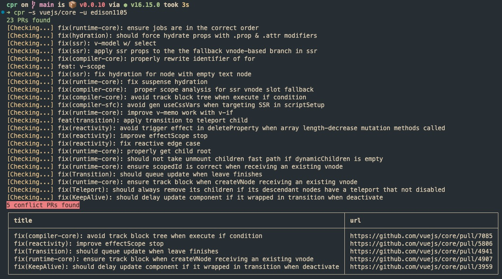

# cpr

Check if your PRs are in conflict.

```bash
npm i -g @edison1105/cpr
```

- `cpr -t <token>` set the token of GitHub. **token is a required**. see [new personal access token](https://github.com/settings/tokens/new?scopes=repo)
- `cpr -u <username>` set the author name of PRs
- `cpr -s <owner/repo> [-u <username>]` list the PRs which has conflicts

## Screenshot

